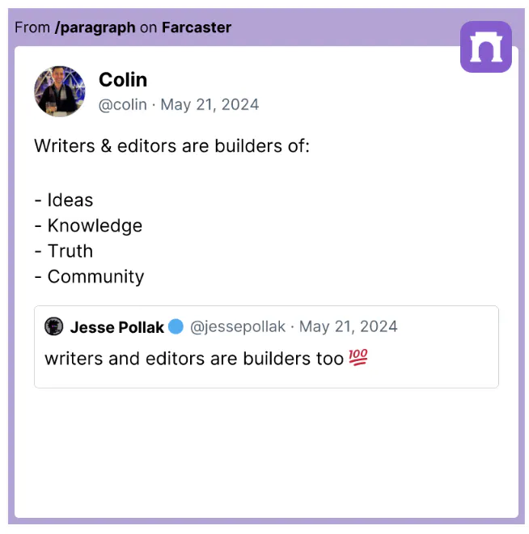

# What is a Onchain Writing Hackathon?

An onchain writing hackathon is an event where participants are challenged to create written content within a set timeframe, focusing on a specific theme or prompt, with content published onchain. 

## Purpose of a Writing Hackathon

Unlike traditional hackathons that focus on coding or technology development, a writing hackathon recognizes that writers are building things too.  

- **Promotes Creative Problem Solving**: Provide a structured environment for brainstorming and creativity, helping to solve large scale and complex challenges.
- **Cultivate URL to IRL Connections**: Bring together writers, creators, and enthusiasts to collaborate, share ideas, and support each other.
- **Explore New Ideas**: Use prompts or themes to inspire new perspectives and ideas, potentially leading to innovative content.
- **The sum is greater than the parts**: Take advantage of network effects to raise more awareness for the chosen topics when essays are written and published  en masse

## Structure of a Writing Hackathon
- **Theme or Prompt**: A central theme or series of prompts guide the content creation.
- **Timeframe**: Participants are given a specific amount of time (e.g., 24 hours, a week) to create their submissions.
- **Submissions**: At the end of the event, participants publish their submissions onchain.

## Writers are Builders

- “Writers and editors are builders too.” - [Jesse Pollak](https://warpcast.com/jessepollak), founder of Base
- "writers and editors are builders of ideas, knowledge, truth, community" -  [Colin Armstrong](https://warpcast.com/colin), founder of Paragraph
- “The most powerful person in the world is the storyteller. The storyteller sets the vision, values, and agenda of an entire generation that is to come.”  - Steve Jobs

## Next Steps

Ready to start planning your own hackathon? [Click here to get started](planning.md).
